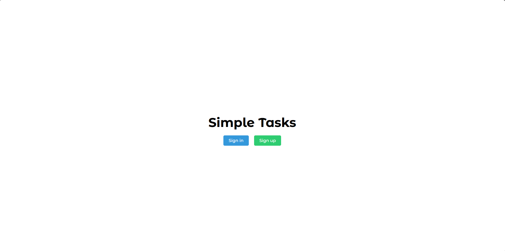
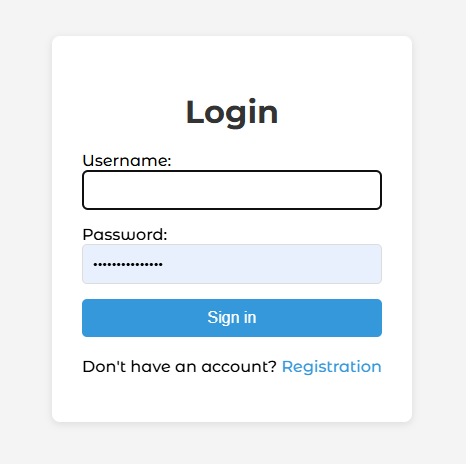
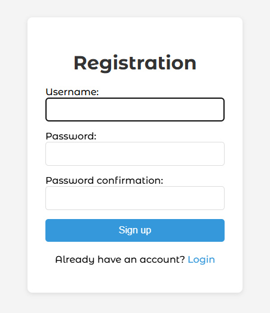
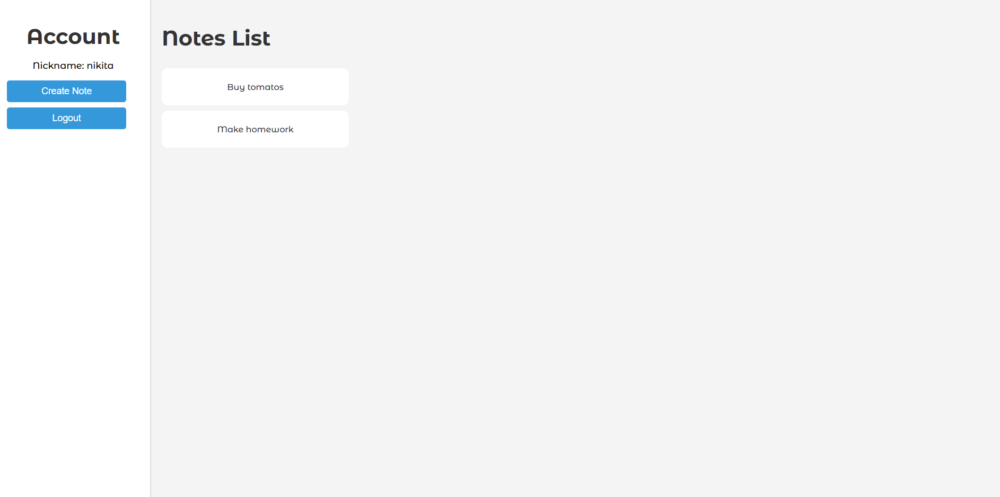
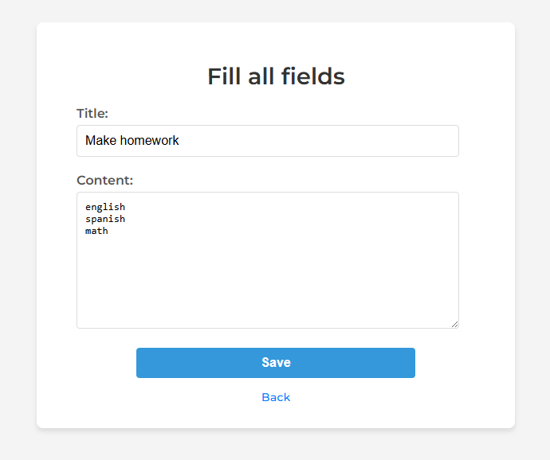
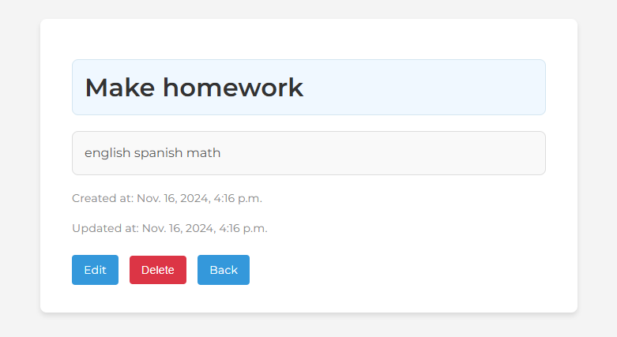

# Simple Tasks Web Application

This is a simple web application for creating, updating, and deleting notes. It provides a user-friendly interface for managing notes, including authentication and personalized note management. The application allows users to securely create and store their notes, edit or delete them, and view a list of all their notes.

## Features
- **User Authentication**: Users can sign up, log in, and securely manage their accounts.
- **Create, Edit, and Delete Notes**: Users can create new notes, update existing ones, and delete notes they no longer need.
- **Note List**: Users can view a list of all their notes.
- **Responsive Design**: The application is designed to work on both desktop and mobile devices.
  
## Technologies Used
- **Backend**: Django (Python framework)
- **Frontend**: HTML, CSS (with Bootstrap for styling), and JavaScript
- **Database**: SQLite (default database used with Django)
- **Authentication**: Django's built-in user authentication system
- **Version Control**: Git, GitHub

## Screenshots

Here are some screenshots of the application:

1. **Main Page**
    

2. **Login Page**
    
  
3. **Sign-Up Page**
    

4. **Home Page with Notes List**
    
  
5. **Edit Note Form**
    

6. **View Note Page**
    

## How to Use

1. **Register**: Create a new account by filling in the registration form.
2. **Log In**: Use your credentials to log in to the application.
3. **Create Notes**: Once logged in, you can create new notes by filling out the title and content fields.
4. **Edit Notes**: You can edit any note by clicking the "Edit" button next to the note.
5. **Delete Notes**: You can delete any note by clicking the "Delete" button. You will be asked to confirm the deletion.

---

Feel free to reach out with any questions or suggestions!
